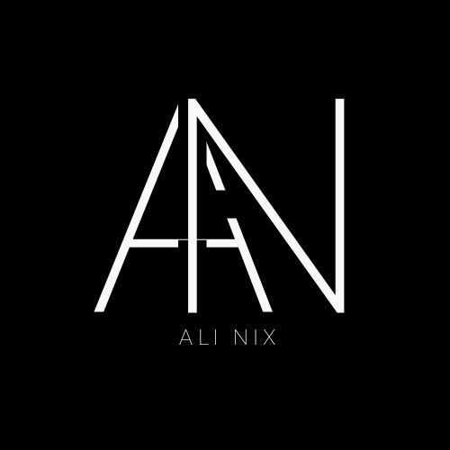

<!-- PROJECT LOGO -->
 

  

  <!-- HEADER -->
<h3 align="center">Portfolio Demo</h3>
  

    A portfolio website created by Ali Nix
     
    <a href="https://github.com/alinix1/portfolio-demo"><strong>Explore the docs »</strong></a>
     
    <a href="https://www.alinix.info/">Visit the Deployed Site »</strong></a>
  

<!-- TABLE OF CONTENTS -->

  
Table of Contents

  <ol>
    <li>
      <a href="#about-the-project">About The Project</a>
      <ul>
        <li><a href="#built-with">Built With</a></li>
      </ul>
    </li>
    <li><a href="#setup">Setup</a></li>
    <li><a href="#usage">Installation</a></li>
    <li><a href="#usage">Usage</a></li>
    <li><a href="#notes">Notes</a></li>
    <li><a href="#roadmap">Roadmap</a></li>
    <li><a href="#roadmap">Acknowledgments</a></li>
    <li><a href="#contact">Contact</a></li>
  </ol>

<!-- ABOUT THE PROJECT -->

## About The Project

This is a portfolio website built with Next.js and Tailwind CSS. It includes a sleek, easy-to-use, and responsive application across various devices. The following features include light/dark mode for accessibility purposes, CSS animations, and responsive design!

### Built With

- ![Next][Next-shield]
- ![JavaScript][JavaScript-shield]
- ![Tailwind][Tailwind-shield]
- ![Vercel][Vercel-shield]
- ![Webpack][Webpack-shield]

(<a href="#readme-top">back to top</a>)

<!-- SETUP -->

## Setup

- Check out the [deployed site](https://www.alinix.info/)

(<a href="#readme-top">back to top</a>)

<!-- USAGE -->

## Usage

(<a href="#readme-top">back to top</a>)

## Feature Overview

- Next.js
- Tailwind CSS
- Deployment on Vercel

## Wins:

- Getting more confident with CSS fundamentals and applying them to Tailwind CSS.
- Using the `<Image>` component from `next/image` instead of `` HTML tag for Lazy Loading.
- Using the `Link` component from `next/link` module to navigate between pages.
- Implementing light/dark mode toggle after following along this [tutorial].

## Challenges:

- At first, it was hard learning the syntax of [TailwindCSS] alongside JSX.
- The planning phase is always one of the most challenging parts of web development. I was able to figure out the Next.js architecture pretty well since it is similar to React.

(<a href="#readme-top">back to top</a>)

<!-- ROADMAP -->

## Roadmap

- [ ] Add a domain for the website
- [ ] Continue work on responsive design
- [ ] Dry up the repetitive code
- [ ] Add testing with [Jestjs]

<!-- ACKNOWLEDGMENTS -->

## Acknowledgments

Used the following resources during the project:

- [![Next][Next-shield]][Nextjs]
- [![Tailwind][Tailwind-shield]][TailwindCSS]

<!-- CONTACT -->

## Contact

Ali Nix | [![LinkedIn][linkedin-shield]][linkedin-url1]

(<a href="#readme-top">back to top</a>)

<!-- MARKDOWN LINKS & IMAGES -->

[JavaScript-shield]: https://img.shields.io/badge/JavaScript-F7DF1E?style=for-the-badge&logo=javascript&logoColor=black
[Tailwind-shield]: https://img.shields.io/badge/Tailwind_CSS-38B2AC?style=for-the-badge&logo=tailwind-css&logoColor=white
[Webpack-shield]: https://img.shields.io/badge/webpack-%238DD6F9.svg?style=for-the-badge&logo=webpack&logoColor=black
[Next-shield]: https://img.shields.io/badge/next%20js-000000?style=for-the-badge&logo=nextdotjs&logoColor=white
[Vercel-shield]: https://img.shields.io/badge/Vercel-000000?style=for-the-badge&logo=vercel&logoColor=white
[linkedin-shield]: https://img.shields.io/badge/-LinkedIn-black.svg?style=for-the-badge&logo=linkedin&colorB=555
[linkedin-url1]: https://www.linkedin.com/in/ali-nix-38b9b9126/
[Nextjs]: https://nextjs.org/
[TailwindCSS]: https://tailwindcss.com/
[Jestjs]: https://jestjs.io/
[tutorial]: https://www.youtube.com/watch?v=1q5oOZE6o4c
